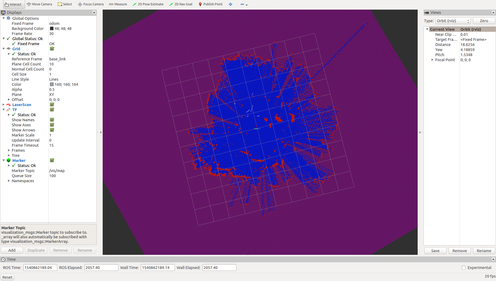

# Labs FAQ and remarks

## Lab1 and Lab2
These two labs contain a simple introduction to ROS, including ROS publisher, subscriber, node and some stuff about python. It should be quite easy if you follow the ROS official tutorials.

One small tip is presented for Part 4 in Lab 2. In order to create multiple turtles in the simulation. I would recommend to use ` rosservice`, such as `rosservice call spawn 1 1 0 turtle`, where three double represent the x, y postion and the rotational angle, respectively.

## Lab3
Please refer to quaternion representation and transformation matrix involving twist representation, which is strongly recommended.

If you have difficulty with Part 1.4, I would recommend you to use `rosrun tf view_frames`, which generates a list of frames in the terminal and summary them up in a pdf file. As you might noticed, the system has more than thirty frames. It's fine to choose any two of them to finish part 1.4.

## Lab3 Baxter
For part 2 of lab 3, we need to use function `set_joint_positions()` to enable the movement to the desired position. Initially we move the robot to a desired position with following codes, 
```
bindings = {
    'left_s0': float(raw_input("Type the angle")),
    'left_s1': float(raw_input("Type the angle")),
    'left_e0': float(raw_input("Type the angle")),
    'left_e1': float(raw_input("Type the angle")),
    'left_w0': float(raw_input("Type the angle")),
    'left_w1': float(raw_input("Type the angle")),
    'left_w2': float(raw_input("Type the angle"))
    }
    done = False
    print("Controlling joints. Press ? for help, Esc to quit.")
    while not done and not rospy.is_shutdown():
    	try:
    		left.set_joint_positions(bindings)    
    	except KeyboardInterrupe:
    		print("escape")
```
With this kind of code, the program won't be stopped automatically when the desired rotational angles are satisfied. Therefore, we need add an uncertainty for the convergence of angle errors. A sample code can be written as follow,
```
our_theta={}
our_theta['right_s0']=np.float32(raw_input())
our_theta['right_s1']=np.float32(raw_input())
our_theta['right_e0']=np.float32(raw_input())
our_theta['right_e1']=np.float32(raw_input())
our_theta['right_w0']=np.float32(raw_input())
our_theta['right_w1']=np.float32(raw_input())
our_theta['right_w2']=np.float32(raw_input())

while( right.joint_angle(lj[0])-our_theta['right_s0']<0.1 or
   right.joint_angle(lj[1])-our_theta['right_s1']<0.1 or
   right.joint_angle(lj[2])-our_theta['right_e0']<0.1 or
   right.joint_angle(lj[3])-our_theta['right_e1']<0.1 or
   right.joint_angle(lj[4])-our_theta['right_w0']<0.1 or
   right.joint_angle(lj[5])-our_theta['right_w1']<0.1 or
   right.joint_angle(lj[6])-our_theta['right_w2']<0.1 ):
 right.set_joint_positions(our_theta)
```


## Lab4
This lab talks about an introductive calibration of camera, including an implementation of Homography matrix and numerical calculations of mapping from pixel coordinates to world coordinates. By following the intructions, this lab work is easily to be finished.

## Lab5

## Lab6
For part 2, please follow the instructions step by step.

For part 3, firstly connect to turtlebot, for example:
```
ssh turtlebot@green.local
```

Launch the ar_marker tracking
```
roslaunch ar_track_alvar webcam_track.launch
```
Establish the static transformation between two frames: ar_marker on the turtlebot and its base_link
```
rosrun tf static_transform_publisher 0.014 0 -0.397 0 0 0 ar_marker_12 base_link 100
```
We can check the configuration of frames, axis in the rviz. Always make sure that two markers are detected by the camera. Please use `rqt_tf_tree` to ensure the transformation is well established
```
rosrun rqt_tf_tree rqt_tf_tree
```

## Lab7

## Lab8
An screenshot of Rviz is presented as below. Notice that the fixed frame of Rviz should be set as "odom".



In order to make sure that each voxel is updated once per ray, we use the temperal variable `x_prev` and `y_prev` to count backwards along the ray from the scan point to the sensor.

```
for i in np.arange(r,0,-0.1):
    x_prev = x_val
    y_prev = y_val
    x_val = i*np.sin(angle)
    y_val = i*np.cos(angle)

    val = self.PointToVoxel(x_val,y_val)
    if self.PointToVoxel(x_val,y_val) != self.PointToVoxel(x_prev,y_prev):
        if i == r:
            self._map[val] += self._occupied_update
            if self._map[val] >= self._occupied_threshold:
                self._map[val] = self._occupied_threshold
        else:
            self._map[val] += self._free_update
            if self._map[val] <= self._free_threshold:
                self._map[val] = self._free_threshold
```
